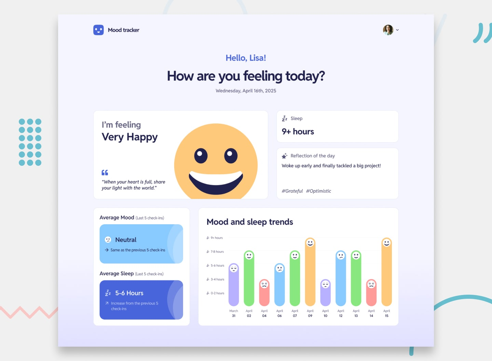

# Frontend Mentor - Mood Tracking App



## Overview

This is a solution to the [Mood Tracking App challenge on Frontend Mentor](https://www.frontendmentor.io/challenges/mood-tracking-app-E2XeKhDF0B). It's a premium challenge that pushes your frontend and full-stack development skills.

---

## Table of Contents

- [Overview](#overview)
- [The Challenge](#the-challenge)
- [Links](#links)
- [Screenshots](#screenshots)
- [My Process](#my-process)
  - [Built With](#built-with)
  - [Folder Structure](#folder-structure)
  - [What I Learned](#what-i-learned)
  - [Continued Development](#continued-development)
  - [Useful Resources](#useful-resources)
- [Getting Started](#getting-started)
- [Author](#author)
- [Acknowledgments](#acknowledgments)

---

## The Challenge

Your users should be able to:

- Log their mood, feelings, reflections, and sleep each day
- See today's mood, feelings, reflection, and sleep, once logged
- See a relevant mood quote based on today's mood (`data.json`)
- See a graph showing the most recent eleven records to identify mood and sleep trends
- Interact with each bar on the mood and sleep trends chart to see details about that day
- See their average mood and sleep from the past five check-ins and compare with the previous five
- Update their name or avatar through settings
- View a responsive layout for mobile, tablet, and desktop
- See hover and focus states for all interactive elements
- **Bonus**:
  - Persist details to a database (full-stack)
  - Add user authentication
  - Integrate a third-party image-hosting service for avatar upload

---

## Links

- **Live Site URL**: [Add your deployed app link here](https://your-live-site.com)
- **Solution URL**: [Add your GitHub repo link here](https://github.com/your-repo)

---

## Screenshots

_Add a screenshot of your UI here. Example:_


## My Process
### Built With
Next.js (App Router, TypeScript)

Tailwind CSS (with custom tokens from Figma)

clsx – conditional classNames

date-fns – for date manipulation

zod – for schema validation

json-server (optional backend mock)

Mobile-first layout strategy

Custom font: Reddit Sans

### Folder Structure
```bash
/public
/src
  ├── /app
  ├── /components
  ├── /data
  ├── /lib
  ├── /types
  └── /styles
tailwind.config.ts
next.config.js
```
### What I Learned
A few key takeaways from this project:

How to configure Tailwind to match a full design system from Figma (custom spacing, colors, font sizes, radius).

Used next/font/google to optimize Google Fonts (Reddit Sans) loading.

Practiced mobile-first responsive design using Tailwind's utility classes.

Built a clean and accessible UI from Figma specs.

### Continued Development
In future projects, I’d like to explore:

Animation libraries (Framer Motion, GSAP)

Backend integration (PostgreSQL + Prisma + Next.js API routes)

Authentication using NextAuth or Clerk

Data visualization improvements

### Useful Resources
Tailwind Docs – great for checking class behavior

Figma Tokens plugin – useful to extract design values

Zod docs – schema validation examples

Next.js App Router Guide – essential for the new app structure

## Getting Started
Clone the repo

Install dependencies: npm install

Start dev server: npm run dev

Navigate to http://localhost:3000

To simulate a backend:

```bash
npm install -D json-server
json-server --watch src/data/data.json --port 3001
```

<!-- ## Author
Frontend Mentor – @yourusername

Twitter – @yourusername

Website – your-website.com -->

## Acknowledgments
Thanks to Frontend Mentor for the awesome challenge, and to the dev community for continued inspiration 💜